# Organograma de Funcionalidades - AppNovo Prática

**Data:** 2026-01-26
**Versão:** 1.0
**Sistema:** AppNovo Prática - Plataforma de Gestão Imobiliária

---

## Visão Geral do Sistema

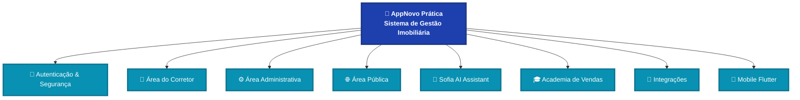

---

## 1. Autenticação & Segurança

```mermaid
graph TB
    classDef modulo fill:#0891b2,stroke:#0e7490,stroke-width:3px,color:#fff
    classDef submodulo fill:#059669,stroke:#047857,stroke-width:2px,color:#fff
    classDef funcao fill:#10b981,stroke:#059669,stroke-width:1px,color:#fff

    AUTH[🔐 Autenticação & Segurança]:::modulo

    AUTH --> AUTH_METHODS[Métodos de Login]:::submodulo
    AUTH --> AUTH_SESSION[Gestão de Sessões]:::submodulo
    AUTH --> AUTH_PROFILE[Perfil & Dados]:::submodulo
    AUTH --> AUTH_CONTROL[Controle de Acesso]:::submodulo

    %% Métodos de Login
    AUTH_METHODS --> AUTH_WHATSAPP[WhatsApp OTP<br/>Envio via Z-API]:::funcao
    AUTH_METHODS --> AUTH_MAGIC[Magic Link Email]:::funcao
    AUTH_METHODS --> AUTH_ADMIN[Login Admin<br/>Email + Senha]:::funcao
    AUTH_METHODS --> AUTH_REGISTER[Registro de Novos Usuários]:::funcao

    %% Gestão de Sessões
    AUTH_SESSION --> AUTH_JWT[JWT Tokens]:::funcao
    AUTH_SESSION --> AUTH_VALIDATE[Validação de Sessão]:::funcao
    AUTH_SESSION --> AUTH_REFRESH[Refresh Automático]:::funcao
    AUTH_SESSION --> AUTH_LOGOUT[Logout & Limpeza]:::funcao
    AUTH_SESSION --> AUTH_TRACKING[Rastreamento de Eventos]:::funcao

    %% Perfil & Dados
    AUTH_PROFILE --> AUTH_ME[Dados do Usuário Logado]:::funcao
    AUTH_PROFILE --> AUTH_UPDATE[Atualizar Perfil]:::funcao
    AUTH_PROFILE --> AUTH_PHOTO[Foto de Perfil]:::funcao

    %% Controle de Acesso
    AUTH_CONTROL --> AUTH_ROLES[Roles: Admin, Gerente, Corretor]:::funcao
    AUTH_CONTROL --> AUTH_MIDDLEWARE[Middleware de Proteção]:::funcao
    AUTH_CONTROL --> AUTH_REDIRECT[Redirecionamento por Role]:::funcao
```

**APIs Relacionadas:**
- `/api/auth/send-otp` - Envia código OTP via WhatsApp
- `/api/auth/verify-otp` - Valida código OTP
- `/api/auth/magic` - Envia magic link por email
- `/api/auth/admin-login` - Login administrativo
- `/api/auth/register` - Registro de novos usuários
- `/api/auth/validate` - Valida sessão ativa
- `/api/auth/me` - Retorna dados do usuário logado
- `/api/auth/profile` - CRUD de perfil de usuário
- `/api/auth/logout` - Encerra sessão

---

## 2. Área do Corretor

```mermaid
graph TB
    classDef modulo fill:#0891b2,stroke:#0e7490,stroke-width:3px,color:#fff
    classDef submodulo fill:#059669,stroke:#047857,stroke-width:2px,color:#fff
    classDef funcao fill:#10b981,stroke:#059669,stroke-width:1px,color:#fff

    CORRETOR[👤 Área do Corretor]:::modulo

    CORRETOR --> CORRETOR_DASH[📊 Dashboard Principal]:::submodulo
    CORRETOR --> CORRETOR_LEADS[🎯 Gestão de Leads]:::submodulo
    CORRETOR --> CORRETOR_IMOVEIS[🏠 Catálogo de Imóveis]:::submodulo
    CORRETOR --> CORRETOR_PROPOSTAS[📄 Propostas Comerciais]:::submodulo
    CORRETOR --> CORRETOR_AGENDA[📅 Agenda & Visitas]:::submodulo
    CORRETOR --> CORRETOR_CHAT[💬 Mensagens & Chat]:::submodulo
    CORRETOR --> CORRETOR_REPORTS[📈 Relatórios]:::submodulo
    CORRETOR --> CORRETOR_CONFIG[⚙️ Configurações]:::submodulo

    %% Dashboard
    CORRETOR_DASH --> DASH_METRICAS[Métricas de Performance]:::funcao
    CORRETOR_DASH --> DASH_METAS[Acompanhamento de Metas]:::funcao
    CORRETOR_DASH --> DASH_COMISSOES[Comissões a Receber]:::funcao
    CORRETOR_DASH --> DASH_ATIVIDADES[Atividades Recentes]:::funcao

    %% Gestão de Leads
    CORRETOR_LEADS --> LEADS_LIST[Listagem de Clientes]:::funcao
    CORRETOR_LEADS --> LEADS_DETAIL[Detalhes do Lead]:::funcao
    CORRETOR_LEADS --> LEADS_SCHEDULE[Agendar Visita]:::funcao
    CORRETOR_LEADS --> LEADS_NOTES[Anotações & Histórico]:::funcao
    CORRETOR_LEADS --> LEADS_STAGE[Alterar Estágio do Lead]:::funcao
    CORRETOR_LEADS --> LEADS_SCORE[Score de Qualificação]:::funcao
    CORRETOR_LEADS --> LEADS_SALVA[Salva Leads<br/>Recuperação de Oportunidades]:::funcao

    %% Catálogo de Imóveis
    CORRETOR_IMOVEIS --> IMOVEIS_LIST[Listar Empreendimentos]:::funcao
    CORRETOR_IMOVEIS --> IMOVEIS_DETAIL[Detalhes do Imóvel]:::funcao
    CORRETOR_IMOVEIS --> IMOVEIS_UNITS[Unidades Disponíveis]:::funcao
    CORRETOR_IMOVEIS --> IMOVEIS_CALC[Calculadora de Financiamento]:::funcao
    CORRETOR_IMOVEIS --> IMOVEIS_SHARE[Compartilhar Imóvel]:::funcao
    CORRETOR_IMOVEIS --> IMOVEIS_COMPARE[Comparar Imóveis]:::funcao

    %% Propostas Comerciais
    CORRETOR_PROPOSTAS --> PROP_CREATE[Criar Proposta]:::funcao
    CORRETOR_PROPOSTAS --> PROP_TEMPLATE[Templates Personalizados]:::funcao
    CORRETOR_PROPOSTAS --> PROP_PDF[Gerar PDF]:::funcao
    CORRETOR_PROPOSTAS --> PROP_SEND[Enviar via WhatsApp/Email]:::funcao
    CORRETOR_PROPOSTAS --> PROP_TRACK[Rastreamento de Visualização]:::funcao

    %% Agenda & Visitas
    CORRETOR_AGENDA --> AGENDA_CALENDAR[Calendário de Visitas]:::funcao
    CORRETOR_AGENDA --> AGENDA_SCHEDULE[Agendar Nova Visita]:::funcao
    CORRETOR_AGENDA --> AGENDA_CONFIRM[Confirmação de Agendamento]:::funcao
    CORRETOR_AGENDA --> AGENDA_REMIND[Lembretes Automáticos]:::funcao

    %% Mensagens & Chat
    CORRETOR_CHAT --> CHAT_WHATSAPP[Integração WhatsApp]:::funcao
    CORRETOR_CHAT --> CHAT_CONVERSATIONS[Conversas com Leads]:::funcao
    CORRETOR_CHAT --> CHAT_SEND[Enviar Mensagens]:::funcao
    CORRETOR_CHAT --> CHAT_MEDIA[Enviar Mídia/Materiais]:::funcao
    CORRETOR_CHAT --> CHAT_TEMPLATES[Templates de Mensagens]:::funcao

    %% Relatórios
    CORRETOR_REPORTS --> REP_PERFORMANCE[Performance de Vendas]:::funcao
    CORRETOR_REPORTS --> REP_COMISSOES[Relatório de Comissões]:::funcao
    CORRETOR_REPORTS --> REP_CONVERSAO[Taxa de Conversão]:::funcao
    CORRETOR_REPORTS --> REP_ATIVIDADES[Histórico de Atividades]:::funcao

    %% Configurações
    CORRETOR_CONFIG --> CONFIG_PERFIL[Editar Perfil]:::funcao
    CORRETOR_CONFIG --> CONFIG_NOTIF[Notificações]:::funcao
    CORRETOR_CONFIG --> CONFIG_WHATSAPP[Vincular WhatsApp]:::funcao
```

**Páginas:**
- `/corretor` - Dashboard do corretor
- `/corretor/clientes` - Gestão de leads/clientes
- `/corretor/salva-leads` - Recuperação de leads perdidos
- `/corretor/imoveis` - Catálogo de imóveis
- `/corretor/propostas` - Propostas comerciais
- `/corretor/agenda` - Agenda de visitas
- `/corretor/mensagens` - Chat e mensagens
- `/corretor/relatorios` - Relatórios de performance
- `/corretor/configuracoes` - Configurações pessoais

**APIs Relacionadas:**
- `/api/leads` - CRUD de leads
- `/api/leads/[id]/schedule-visit` - Agendamento de visitas
- `/api/leads/[id]/stage` - Mudança de estágio
- `/api/salva-leads/conversations` - Conversas de recuperação
- `/api/salva-leads/schedule` - Agendamento salva-leads
- `/api/salva-leads/stats` - Estatísticas de recuperação
- `/api/empreendimentos` - Listagem de empreendimentos
- `/api/unidades` - Unidades disponíveis
- `/api/series` - Séries de empreendimentos
- `/api/corretores` - Dados de corretores
- `/api/user/update` - Atualização de perfil

---

## 3. Área Administrativa

```mermaid
graph TB
    classDef modulo fill:#0891b2,stroke:#0e7490,stroke-width:3px,color:#fff
    classDef submodulo fill:#059669,stroke:#047857,stroke-width:2px,color:#fff
    classDef funcao fill:#10b981,stroke:#059669,stroke-width:1px,color:#fff

    ADMIN[⚙️ Área Administrativa]:::modulo

    ADMIN --> ADMIN_DASH[📊 Dashboard Executivo]:::submodulo
    ADMIN --> ADMIN_PIPELINE[🎯 Pipeline de Vendas]:::submodulo
    ADMIN --> ADMIN_TEAM[👥 Gestão de Equipe]:::submodulo
    ADMIN --> ADMIN_LEADS[📋 Leads Centralizados]:::submodulo
    ADMIN --> ADMIN_WHATSAPP[📱 WhatsApp Management]:::submodulo
    ADMIN --> ADMIN_AUTOMATION[🤖 Automações & Campanhas]:::submodulo
    ADMIN --> ADMIN_REPORTS[📈 Relatórios Avançados]:::submodulo
    ADMIN --> ADMIN_SYNC[🔄 Sincronização CV CRM]:::submodulo

    %% Dashboard Executivo
    ADMIN_DASH --> ADMIN_DASH_KPI[KPIs de Vendas]:::funcao
    ADMIN_DASH --> ADMIN_DASH_REVENUE[Receita & Comissões]:::funcao
    ADMIN_DASH --> ADMIN_DASH_CONVERSION[Funil de Conversão]:::funcao
    ADMIN_DASH --> ADMIN_DASH_TEAM_PERF[Performance da Equipe]:::funcao

    %% Pipeline de Vendas
    ADMIN_PIPELINE --> PIPE_KANBAN[Kanban de Oportunidades]:::funcao
    ADMIN_PIPELINE --> PIPE_STAGES[Gestão de Estágios]:::funcao
    ADMIN_PIPELINE --> PIPE_MOVE[Mover Leads no Pipeline]:::funcao
    ADMIN_PIPELINE --> PIPE_CVCRM[Sincronização CV CRM]:::funcao
    ADMIN_PIPELINE --> PIPE_INSIGHTS[Insights com IA]:::funcao

    %% Gestão de Equipe
    ADMIN_TEAM --> TEAM_LIST[Listar Corretores]:::funcao
    ADMIN_TEAM --> TEAM_METRICS[Métricas por Corretor]:::funcao
    ADMIN_TEAM --> TEAM_GOALS[Metas Individuais]:::funcao
    ADMIN_TEAM --> TEAM_RANKING[Ranking de Performance]:::funcao
    ADMIN_TEAM --> TEAM_USERS[Gestão de Usuários]:::funcao
    ADMIN_TEAM --> TEAM_PERMISSIONS[Permissões & Roles]:::funcao

    %% Leads Centralizados
    ADMIN_LEADS --> ADMIN_LEADS_ALL[Visualizar Todos os Leads]:::funcao
    ADMIN_LEADS --> ADMIN_LEADS_ASSIGN[Distribuir Leads]:::funcao
    ADMIN_LEADS --> ADMIN_LEADS_SCORE[Score & Qualificação]:::funcao
    ADMIN_LEADS --> ADMIN_LEADS_STATUS[Status Tracking]:::funcao
    ADMIN_LEADS --> ADMIN_LEADS_RECOVERY[Recuperação Automática]:::funcao

    %% WhatsApp Management
    ADMIN_WHATSAPP --> WA_INSTANCES[Gerenciar Instâncias]:::funcao
    ADMIN_WHATSAPP --> WA_SESSIONS[Status de Sessões]:::funcao
    ADMIN_WHATSAPP --> WA_CHAT[Chat Centralizado]:::funcao
    ADMIN_WHATSAPP --> WA_MESSAGES[Histórico de Mensagens]:::funcao
    ADMIN_WHATSAPP --> WA_SYNC[Sincronizar Oportunidades]:::funcao
    ADMIN_WHATSAPP --> WA_LOGOUT[Desconectar Sessões]:::funcao

    %% Automações & Campanhas
    ADMIN_AUTOMATION --> AUTO_CAMPAIGNS[Criar Campanhas]:::funcao
    ADMIN_AUTOMATION --> AUTO_RULES[Regras de Automação]:::funcao
    ADMIN_AUTOMATION --> AUTO_TRIGGERS[Gatilhos Automáticos]:::funcao
    ADMIN_AUTOMATION --> AUTO_AI[Sugestões com IA]:::funcao
    ADMIN_AUTOMATION --> AUTO_SCHEDULE[Agendamento de Envios]:::funcao

    %% Relatórios Avançados
    ADMIN_REPORTS --> REP_SALES[Relatório de Vendas]:::funcao
    ADMIN_REPORTS --> REP_CONVERSION[Análise de Conversão]:::funcao
    ADMIN_REPORTS --> REP_TEAM[Performance da Equipe]:::funcao
    ADMIN_REPORTS --> REP_LEADS[Origem de Leads]:::funcao
    ADMIN_REPORTS --> REP_EXPORT[Exportar Dados]:::funcao

    %% Sincronização CV CRM
    ADMIN_SYNC --> SYNC_FULL[Sincronização Completa]:::funcao
    ADMIN_SYNC --> SYNC_INCREMENTAL[Sincronização Incremental]:::funcao
    ADMIN_SYNC --> SYNC_TEST[Testar Conexão]:::funcao
    ADMIN_SYNC --> SYNC_IMOBILIARIAS[Imobiliárias Parceiras]:::funcao
    ADMIN_SYNC --> SYNC_STATUS[Status de Sincronização]:::funcao
```

**Páginas:**
- `/admin` - Dashboard executivo
- `/admin/pipeline` - Pipeline de vendas (Kanban)
- `/admin/leads` - Gestão centralizada de leads
- `/admin/status` - Status tracking de leads
- `/admin/score` - Sistema de score
- `/admin/equipe` - Gestão de equipe
- `/admin/agenda` - Agenda geral
- `/admin/whatsapp` - Gerenciamento WhatsApp
- `/admin/whatsapp/chat/[instanceName]` - Chat por instância
- `/admin/chat` - Chat centralizado
- `/admin/automations` - Automações e regras
- `/admin/campaigns` - Campanhas de marketing
- `/admin/reports` - Relatórios avançados

**APIs Relacionadas:**
- `/api/crm/pipeline` - Pipeline de vendas
- `/api/crm/pipeline/move` - Mover lead no pipeline
- `/api/crm/pipeline-cvcrm` - Sincronizar com CV CRM
- `/api/crm/stats` - Estatísticas gerais
- `/api/crm/stats/stream` - Stream de estatísticas
- `/api/crm/team-metrics` - Métricas da equipe
- `/api/crm/goals` - Metas e objetivos
- `/api/crm/activities` - Atividades do CRM
- `/api/crm/conversations` - Conversas centralizadas
- `/api/crm/automations` - Automações
- `/api/crm/campaigns` - Campanhas
- `/api/crm/reports` - Relatórios
- `/api/crm/ai-insights` - Insights com IA
- `/api/crm/ai-suggestions` - Sugestões com IA
- `/api/admin/users` - Gestão de usuários
- `/api/admin/imobiliarias` - Imobiliárias parceiras
- `/api/admin/sync` - Sincronização incremental
- `/api/admin/sync/full` - Sincronização completa
- `/api/whatsapp/session/start` - Iniciar sessão WhatsApp
- `/api/whatsapp/session/status` - Status da sessão
- `/api/whatsapp/session/logout` - Desconectar sessão
- `/api/whatsapp/messages` - Mensagens WhatsApp
- `/api/whatsapp/sync` - Sincronizar mensagens
- `/api/whatsapp/sync/opportunities` - Sincronizar oportunidades

---

## 4. Área Pública

```mermaid
graph TB
    classDef modulo fill:#0891b2,stroke:#0e7490,stroke-width:3px,color:#fff
    classDef submodulo fill:#059669,stroke:#047857,stroke-width:2px,color:#fff
    classDef funcao fill:#10b981,stroke:#059669,stroke-width:1px,color:#fff

    PUBLIC[🌐 Área Pública]:::modulo

    PUBLIC --> PUBLIC_HOME[🏠 Landing Page]:::submodulo
    PUBLIC --> PUBLIC_CATALOG[🏢 Catálogo de Imóveis]:::submodulo
    PUBLIC --> PUBLIC_CALC[🧮 Calculadora Financeira]:::submodulo
    PUBLIC --> PUBLIC_INSIGHTS[💡 Insights de Mercado]:::submodulo
    PUBLIC --> PUBLIC_SHARE[🔗 Compartilhamento]:::submodulo
    PUBLIC --> PUBLIC_COMPARE[⚖️ Comparação]:::submodulo
    PUBLIC --> PUBLIC_CHAT[💬 Chat Público]:::submodulo

    %% Landing Page
    PUBLIC_HOME --> HOME_HERO[Hero Section]:::funcao
    PUBLIC_HOME --> HOME_FEATURED[Imóveis em Destaque]:::funcao
    PUBLIC_HOME --> HOME_CTA[Call to Action]:::funcao
    PUBLIC_HOME --> HOME_CONTACT[Formulário de Contato]:::funcao

    %% Catálogo de Imóveis
    PUBLIC_CATALOG --> CAT_LIST[Listar Empreendimentos]:::funcao
    PUBLIC_CATALOG --> CAT_FILTER[Filtros Avançados]:::funcao
    PUBLIC_CATALOG --> CAT_DETAIL[Detalhes do Imóvel]:::funcao
    PUBLIC_CATALOG --> CAT_GALLERY[Galeria de Fotos]:::funcao
    PUBLIC_CATALOG --> CAT_MAP[Mapa de Localização]:::funcao
    PUBLIC_CATALOG --> CAT_UNITS[Plantas & Unidades]:::funcao

    %% Calculadora Financeira
    PUBLIC_CALC --> CALC_SIMPLES[Simulação Simples]:::funcao
    PUBLIC_CALC --> CALC_JUNCAO[Simulação Junção<br/>Múltiplos Imóveis]:::funcao
    PUBLIC_CALC --> CALC_CAIXA[Tabela CAIXA]:::funcao
    PUBLIC_CALC --> CALC_PDF[Exportar PDF]:::funcao
    PUBLIC_CALC --> CALC_INSIGHTS[Insights com IA]:::funcao
    PUBLIC_CALC --> CALC_SHARE[Compartilhar Simulação]:::funcao

    %% Insights de Mercado
    PUBLIC_INSIGHTS --> INS_ARTICLES[Artigos & Conteúdo]:::funcao
    PUBLIC_INSIGHTS --> INS_TRENDS[Tendências de Mercado]:::funcao
    PUBLIC_INSIGHTS --> INS_ANALYSIS[Análise de Investimento]:::funcao

    %% Compartilhamento
    PUBLIC_SHARE --> SHARE_LINK[Link Personalizado]:::funcao
    PUBLIC_SHARE --> SHARE_WHATSAPP[WhatsApp Share]:::funcao
    PUBLIC_SHARE --> SHARE_SOCIAL[Redes Sociais]:::funcao
    PUBLIC_SHARE --> SHARE_TRACK[Rastreamento de Visualizações]:::funcao

    %% Comparação
    PUBLIC_COMPARE --> COMP_SELECT[Selecionar Imóveis]:::funcao
    PUBLIC_COMPARE --> COMP_TABLE[Tabela Comparativa]:::funcao
    PUBLIC_COMPARE --> COMP_FEATURES[Comparar Características]:::funcao
    PUBLIC_COMPARE --> COMP_PRICE[Análise de Preços]:::funcao

    %% Chat Público
    PUBLIC_CHAT --> CHAT_WIDGET[Widget de Chat]:::funcao
    PUBLIC_CHAT --> CHAT_LEAD[Captura de Lead]:::funcao
    PUBLIC_CHAT --> CHAT_BOT[Bot Automático]:::funcao
```

**Páginas:**
- `/` - Landing page principal
- `/empreendimentos` - Catálogo de empreendimentos
- `/empreendimentos/[id]` - Detalhes do empreendimento
- `/calculadora` - Calculadora de financiamento
- `/calculadora/juncao` - Simulação de junção
- `/insights/[slug]` - Insights de mercado
- `/share/[id]` - Compartilhamento de imóveis
- `/comparacao` - Comparação de imóveis
- `/chat` - Chat público
- `/onboarding/whatsapp` - Onboarding WhatsApp

**APIs Relacionadas:**
- `/api/empreendimentos` - Listagem de empreendimentos
- `/api/unidades` - Unidades disponíveis
- `/api/series` - Séries de empreendimentos
- `/api/simular` - Simulação de financiamento
- `/api/simular-caixa` - Simulação CAIXA
- `/api/ai/junction-insights` - Insights IA para junção
- `/api/pdf/simulacao` - PDF de simulação
- `/api/pdf/tabela` - PDF de tabela de preços
- `/api/pdf/book` - Book de vendas PDF
- `/api/materiais` - Materiais de marketing
- `/api/materials/[token]` - Material por token
- `/api/chat` - Chat público
- `/api/cpf-score` - Score de CPF

---

## 5. Sofia AI Assistant

```mermaid
graph TB
    classDef modulo fill:#f59e0b,stroke:#d97706,stroke-width:3px,color:#fff
    classDef submodulo fill:#059669,stroke:#047857,stroke-width:2px,color:#fff
    classDef funcao fill:#10b981,stroke:#059669,stroke-width:1px,color:#fff

    SOFIA[🤖 Sofia AI Assistant]:::modulo

    SOFIA --> SOFIA_CORE[🧠 Motor de IA]:::submodulo
    SOFIA --> SOFIA_INTENTS[🎯 Reconhecimento de Intenções]:::submodulo
    SOFIA --> SOFIA_ACTIONS[⚡ Ações Automáticas]:::submodulo
    SOFIA --> SOFIA_KNOWLEDGE[📚 Base de Conhecimento]:::submodulo
    SOFIA --> SOFIA_MEMORY[💾 Memória Conversacional]:::submodulo
    SOFIA --> SOFIA_ANALYTICS[📊 Analytics & Métricas]:::submodulo

    %% Motor de IA
    SOFIA_CORE --> CORE_OPENAI[OpenAI GPT-4]:::funcao
    SOFIA_CORE --> CORE_CONTEXT[Gestão de Contexto]:::funcao
    SOFIA_CORE --> CORE_PERSONALITY[Personalidade & Tom]:::funcao
    SOFIA_CORE --> CORE_RAG[RAG - Retrieval Augmented Generation]:::funcao

    %% Reconhecimento de Intenções
    SOFIA_INTENTS --> INT_GREETING[Saudações]:::funcao
    SOFIA_INTENTS --> INT_INFO[Consulta de Informações]:::funcao
    SOFIA_INTENTS --> INT_SIMULATION[Solicitação de Simulação]:::funcao
    SOFIA_INTENTS --> INT_SCHEDULE[Agendar Visita]:::funcao
    SOFIA_INTENTS --> INT_STATUS[Consultar Status]:::funcao
    SOFIA_INTENTS --> INT_COMMISSION[Consultar Comissões]:::funcao
    SOFIA_INTENTS --> INT_GOALS[Consultar Metas]:::funcao
    SOFIA_INTENTS --> INT_AGENDA[Verificar Agenda]:::funcao
    SOFIA_INTENTS --> INT_FALLBACK[Fallback Genérico]:::funcao

    %% Ações Automáticas
    SOFIA_ACTIONS --> ACT_SEND_MATERIAL[Enviar Material]:::funcao
    SOFIA_ACTIONS --> ACT_SEND_MEDIA[Enviar Mídia]:::funcao
    SOFIA_ACTIONS --> ACT_CREATE_LEAD[Criar Lead no CRM]:::funcao
    SOFIA_ACTIONS --> ACT_SCHEDULE_VISIT[Agendar Visita]:::funcao
    SOFIA_ACTIONS --> ACT_GENERATE_PDF[Gerar Proposta PDF]:::funcao
    SOFIA_ACTIONS --> ACT_QUALIFY[Qualificar Lead]:::funcao
    SOFIA_ACTIONS --> ACT_NOTIFY[Notificar Corretor]:::funcao

    %% Base de Conhecimento
    SOFIA_KNOWLEDGE --> KB_PROPERTIES[Informações de Imóveis]:::funcao
    SOFIA_KNOWLEDGE --> KB_FAQ[Perguntas Frequentes]:::funcao
    SOFIA_KNOWLEDGE --> KB_RULES[Regras de Negócio]:::funcao
    SOFIA_KNOWLEDGE --> KB_PRICES[Tabelas de Preços]:::funcao
    SOFIA_KNOWLEDGE --> KB_DOCS[Documentação Necessária]:::funcao

    %% Memória Conversacional
    SOFIA_MEMORY --> MEM_SHORT[Memória de Curto Prazo<br/>Contexto da Conversa]:::funcao
    SOFIA_MEMORY --> MEM_LONG[Memória de Longo Prazo<br/>Preferências do Cliente]:::funcao
    SOFIA_MEMORY --> MEM_INTERACTIONS[Histórico de Interações]:::funcao
    SOFIA_MEMORY --> MEM_SENTIMENT[Análise de Sentimento]:::funcao

    %% Analytics & Métricas
    SOFIA_ANALYTICS --> ANA_CONVERSATIONS[Total de Conversas]:::funcao
    SOFIA_ANALYTICS --> ANA_LEADS[Leads Qualificados]:::funcao
    SOFIA_ANALYTICS --> ANA_CONVERSION[Taxa de Conversão]:::funcao
    SOFIA_ANALYTICS --> ANA_SATISFACTION[Satisfação do Cliente]:::funcao
    SOFIA_ANALYTICS --> ANA_RESPONSE_TIME[Tempo de Resposta]:::funcao
```

**Localização:**
- `/app/api/sofia/` - APIs da Sofia
- `/SOFIA_APRIMORAMENTOS.md` - Roadmap de melhorias

**APIs Relacionadas:**
- `/api/sofia/metrics` - Métricas da Sofia
- `/api/whatsapp/send` - Enviar mensagem
- `/api/whatsapp/send-media` - Enviar mídia
- `/api/whatsapp/send-material` - Enviar material
- `/api/whatsapp/typing` - Indicador de digitação
- `/api/webhook/zapi` - Webhook Z-API
- `/api/webhook/evolution/[tenantId]` - Webhook Evolution API
- `/api/webhook/baileys` - Webhook Baileys
- `/api/interacoes` - Registro de interações

**Roadmap de Aprimoramentos (4 Fases):**
1. **Fase 1:** Novos intents (status, comissões, metas, agenda)
2. **Fase 2:** Base de conhecimento dinâmica (FAQ + regras de negócio)
3. **Fase 3:** Personalização e memória de longo prazo
4. **Fase 4:** Ações diretas + gatilhos proativos

---

## 6. Academia de Vendas

```mermaid
graph TB
    classDef modulo fill:#0891b2,stroke:#0e7490,stroke-width:3px,color:#fff
    classDef submodulo fill:#059669,stroke:#047857,stroke-width:2px,color:#fff
    classDef funcao fill:#10b981,stroke:#059669,stroke-width:1px,color:#fff

    ACADEMY[🎓 Academia de Vendas]:::modulo

    ACADEMY --> ACAD_CATALOG[📚 Catálogo de Cursos]:::submodulo
    ACADEMY --> ACAD_MODULES[📖 Módulos & Lições]:::submodulo
    ACADEMY --> ACAD_PROGRESS[📈 Progresso]:::submodulo
    ACADEMY --> ACAD_CERT[🏆 Certificados]:::submodulo

    %% Catálogo de Cursos
    ACAD_CATALOG --> CAT_CATEGORIES[Categorias de Conteúdo]:::funcao
    ACAD_CATALOG --> CAT_BROWSE[Navegar Cursos]:::funcao
    ACAD_CATALOG --> CAT_SEARCH[Buscar Treinamentos]:::funcao

    %% Módulos & Lições
    ACAD_MODULES --> MOD_LIST[Listar Módulos]:::funcao
    ACAD_MODULES --> MOD_LESSONS[Lições do Módulo]:::funcao
    ACAD_MODULES --> MOD_VIDEO[Vídeos Educacionais]:::funcao
    ACAD_MODULES --> MOD_QUIZ[Quizzes & Avaliações]:::funcao
    ACAD_MODULES --> MOD_MATERIALS[Materiais Complementares]:::funcao

    %% Progresso
    ACAD_PROGRESS --> PROG_TRACK[Rastreamento de Progresso]:::funcao
    ACAD_PROGRESS --> PROG_COMPLETE[Marcar como Completo]:::funcao
    ACAD_PROGRESS --> PROG_STATS[Estatísticas de Aprendizado]:::funcao

    %% Certificados
    ACAD_CERT --> CERT_GENERATE[Gerar Certificado]:::funcao
    ACAD_CERT --> CERT_LIST[Meus Certificados]:::funcao
    ACAD_CERT --> CERT_DOWNLOAD[Download PDF]:::funcao
    ACAD_CERT --> CERT_SHARE[Compartilhar Certificado]:::funcao
```

**Páginas:**
- `/academy` - Home da academia
- `/academy/[categoria]` - Categoria de cursos
- `/academy/[categoria]/[modulo]` - Módulo específico
- `/academy/[categoria]/[modulo]/[licao]` - Lição individual
- `/academy/certificados` - Certificados obtidos

**APIs Relacionadas:**
- `/api/academy/categories` - Categorias de cursos
- `/api/academy/modules` - Módulos disponíveis
- `/api/academy/lessons` - Lições do curso
- `/api/academy/progress` - Progresso do usuário
- `/api/academy/certificates` - Certificados emitidos

---

## 7. Integrações Externas

```mermaid
graph TB
    classDef modulo fill:#7c3aed,stroke:#6d28d9,stroke-width:3px,color:#fff
    classDef submodulo fill:#059669,stroke:#047857,stroke-width:2px,color:#fff
    classDef funcao fill:#10b981,stroke:#059669,stroke-width:1px,color:#fff

    INTEGRATIONS[🔌 Integrações Externas]:::modulo

    INTEGRATIONS --> INT_CVCRM[🏢 CV CRM]:::submodulo
    INTEGRATIONS --> INT_WHATSAPP[📱 WhatsApp]:::submodulo
    INTEGRATIONS --> INT_OPENAI[🤖 OpenAI]:::submodulo
    INTEGRATIONS --> INT_PAYMENT[💳 Pagamentos]:::submodulo
    INTEGRATIONS --> INT_ANALYTICS[📊 Analytics]:::submodulo
    INTEGRATIONS --> INT_WEBHOOK[🔔 Webhooks]:::submodulo

    %% CV CRM
    INT_CVCRM --> CVCRM_AUTH[Autenticação Multi-Token]:::funcao
    INT_CVCRM --> CVCRM_SYNC[Sincronização de Dados]:::funcao
    INT_CVCRM --> CVCRM_PROPERTIES[Empreendimentos]:::funcao
    INT_CVCRM --> CVCRM_UNITS[Unidades]:::funcao
    INT_CVCRM --> CVCRM_BROKERS[Corretores]:::funcao
    INT_CVCRM --> CVCRM_LEADS[Leads]:::funcao
    INT_CVCRM --> CVCRM_RESERVATIONS[Reservas]:::funcao
    INT_CVCRM --> CVCRM_IMOBILIARIAS[Imobiliárias]:::funcao

    %% WhatsApp
    INT_WHATSAPP --> WA_ZAPI[Z-API Integration]:::funcao
    INT_WHATSAPP --> WA_EVOLUTION[Evolution API]:::funcao
    INT_WHATSAPP --> WA_BAILEYS[Baileys Library]:::funcao
    INT_WHATSAPP --> WA_SEND[Envio de Mensagens]:::funcao
    INT_WHATSAPP --> WA_RECEIVE[Recebimento de Mensagens]:::funcao
    INT_WHATSAPP --> WA_MEDIA[Upload/Download Mídia]:::funcao
    INT_WHATSAPP --> WA_SESSION[Gestão de Sessões]:::funcao

    %% OpenAI
    INT_OPENAI --> AI_CHAT[Chat Completion]:::funcao
    INT_OPENAI --> AI_EMBEDDINGS[Embeddings para RAG]:::funcao
    INT_OPENAI --> AI_INSIGHTS[Geração de Insights]:::funcao
    INT_OPENAI --> AI_SUGGESTIONS[Sugestões Inteligentes]:::funcao

    %% Pagamentos
    INT_PAYMENT --> PAY_GATEWAY[Gateway de Pagamento]:::funcao
    INT_PAYMENT --> PAY_COMMISSION[Comissões]:::funcao
    INT_PAYMENT --> PAY_TRACKING[Rastreamento]:::funcao

    %% Analytics
    INT_ANALYTICS --> ANA_VERCEL[Vercel Analytics]:::funcao
    INT_ANALYTICS --> ANA_TRACK[Event Tracking]:::funcao
    INT_ANALYTICS --> ANA_METRICS[Métricas Customizadas]:::funcao

    %% Webhooks
    INT_WEBHOOK --> WEBHOOK_ZAPI[Z-API Webhook]:::funcao
    INT_WEBHOOK --> WEBHOOK_EVOLUTION[Evolution Webhook]:::funcao
    INT_WEBHOOK --> WEBHOOK_BAILEYS[Baileys Webhook]:::funcao
    INT_WEBHOOK --> WEBHOOK_ORULO[Orulo Webhook]:::funcao
```

**APIs de Integração:**
- `/api/sync/cvcrm` - Sincronizar com CV CRM
- `/api/sync/all` - Sincronização completa
- `/api/sync/test` - Testar conexões
- `/api/webhook/zapi` - Webhook Z-API
- `/api/webhook/evolution/[tenantId]` - Webhook Evolution
- `/api/webhook/baileys` - Webhook Baileys
- `/api/webhook/orulo` - Webhook Orulo
- `/api/analytics/track` - Event tracking
- `/api/track` - Tracking genérico

**Variáveis de Ambiente (.env.local):**
- `CVCRM_*_EMAIL` e `CVCRM_*_TOKEN` - Tokens CV CRM (múltiplos endpoints)
- `ZAPI_*` - Credenciais Z-API
- `OPENAI_API_KEY` - Chave OpenAI
- `NEXT_PUBLIC_VERCEL_ANALYTICS_ID` - ID Analytics

---

## 8. Mobile App Flutter

```mermaid
graph TB
    classDef modulo fill:#db2777,stroke:#be185d,stroke-width:3px,color:#fff
    classDef submodulo fill:#059669,stroke:#047857,stroke-width:2px,color:#fff
    classDef funcao fill:#10b981,stroke:#059669,stroke-width:1px,color:#fff

    MOBILE[📱 Mobile App Flutter]:::modulo

    MOBILE --> MOB_AUTH[🔐 Autenticação Mobile]:::submodulo
    MOBILE --> MOB_FEATURES[✨ Funcionalidades]:::submodulo
    MOBILE --> MOB_SYNC[🔄 Sincronização]:::submodulo
    MOBILE --> MOB_BUILD[🏗️ Build & Deploy]:::submodulo

    %% Autenticação Mobile
    MOB_AUTH --> MOB_LOGIN[Login via API]:::funcao
    MOB_AUTH --> MOB_TOKEN[Gestão de Tokens]:::funcao
    MOB_AUTH --> MOB_PROFILE[Perfil do Usuário]:::funcao
    MOB_AUTH --> MOB_LOGOUT[Logout]:::funcao

    %% Funcionalidades
    MOB_FEATURES --> MOB_CATALOG[Catálogo de Imóveis]:::funcao
    MOB_FEATURES --> MOB_CALC[Calculadora]:::funcao
    MOB_FEATURES --> MOB_LEADS_MOB[Gestão de Leads]:::funcao
    MOB_FEATURES --> MOB_CHAT[Chat WhatsApp]:::funcao
    MOB_FEATURES --> MOB_NOTIF[Notificações Push]:::funcao

    %% Sincronização
    MOB_SYNC --> MOB_OFFLINE[Modo Offline]:::funcao
    MOB_SYNC --> MOB_CACHE[Cache Local]:::funcao
    MOB_SYNC --> MOB_REFRESH[Refresh de Dados]:::funcao

    %% Build & Deploy
    MOB_BUILD --> MOB_CAPACITOR[Capacitor Android]:::funcao
    MOB_BUILD --> MOB_APK[Geração de APK]:::funcao
    MOB_BUILD --> MOB_RELEASE[Build de Release]:::funcao
```

**Localização:**
- `/flutter_app/` - Código-fonte Flutter
- `/android/` - Projeto Android nativo
- `capacitor.config.ts` - Configuração Capacitor

**APIs Mobile Dedicadas:**
- `/api/auth/me` - Dados do usuário logado (mobile)
- `/api/auth/profile` - CRUD de perfil (mobile)
- `/api/auth/logout` - Logout (mobile)

**Scripts de Build:**
- `pnpm cap:sync` - Sincronizar código com Android
- `pnpm cap:open` - Abrir Android Studio
- `pnpm cap:build` - Gerar APK debug
- `pnpm cap:build:release` - Gerar APK release

**Arquivos APK Gerados:**
- `pratica-app.apk` (4.1 MB) - Build web view
- `pratica-flutter.apk` (50 MB) - Build Flutter completo

---

## 9. APIs de Suporte & Utilidades

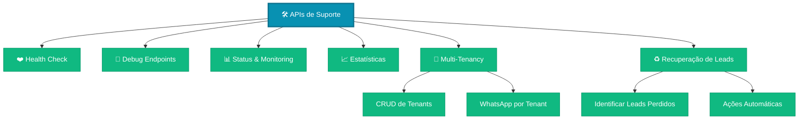

**APIs:**
- `/api/health` - Health check do sistema
- `/api/status` - Status geral
- `/api/debug` - Endpoints de debug
- `/api/stats/simulations` - Estatísticas de simulações
- `/api/tenants` - Gestão multi-tenant
- `/api/tenants/[id]` - CRUD de tenant específico
- `/api/tenants/[id]/whatsapp` - WhatsApp por tenant
- `/api/lead-recovery` - Sistema de recuperação de leads

---

## 10. Fluxo de Dados Principal

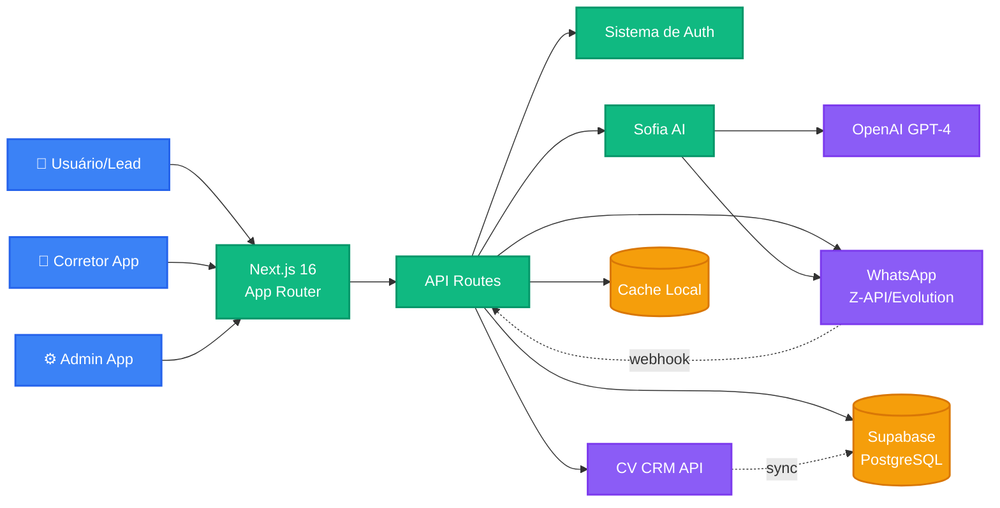

---

## 11. Arquitetura de Camadas

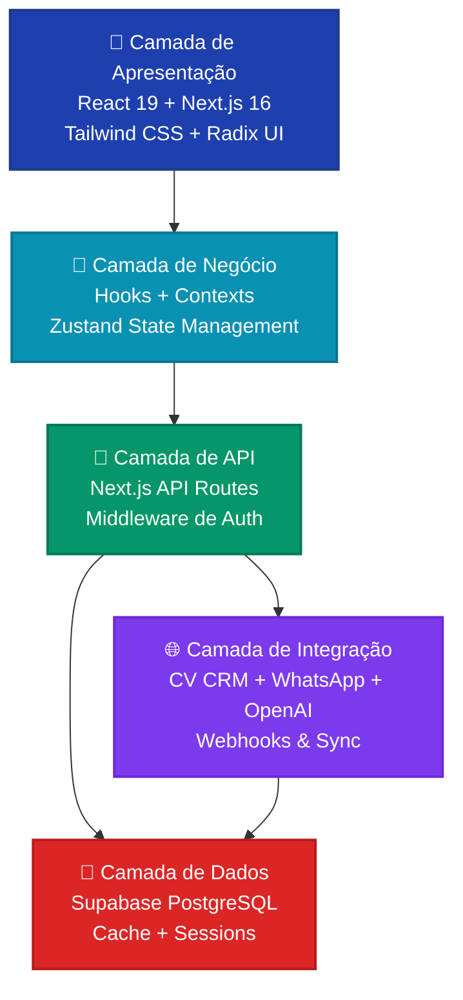

---

## Resumo Executivo

### Total de Funcionalidades

| Módulo | Páginas | APIs | Funcionalidades |
|--------|---------|------|-----------------|
| Autenticação | 2 | 10 | 15+ |
| Área do Corretor | 10 | 15+ | 60+ |
| Área Administrativa | 13 | 25+ | 80+ |
| Área Pública | 8 | 12 | 35+ |
| Sofia AI | 0 | 5+ | 25+ |
| Academia | 5 | 5 | 15+ |
| Integrações | 0 | 20+ | 30+ |
| Mobile | - | 3 | 10+ |
| **TOTAL** | **38+** | **95+** | **270+** |

### Stack Tecnológico

**Frontend:**
- Next.js 16 (App Router)
- React 19
- TypeScript
- Tailwind CSS 4
- Radix UI (componentes)
- Framer Motion (animações)
- Recharts (gráficos)

**Backend:**
- Next.js API Routes
- Node.js
- PostgreSQL (Supabase)
- OpenAI GPT-4
- WhatsApp APIs (Z-API, Evolution, Baileys)

**Mobile:**
- Flutter
- Capacitor (Android)

**Infraestrutura:**
- Vercel (hosting)
- Supabase (database)
- CV CRM (integração)

### Integrações Principais

1. **CV CRM** - Sistema de gestão imobiliária (8+ endpoints)
2. **WhatsApp** - Z-API, Evolution API, Baileys
3. **OpenAI** - GPT-4 para Sofia AI
4. **Vercel Analytics** - Métricas de uso

---

## Conclusão

O **AppNovo Prática** é uma plataforma completa e robusta de gestão imobiliária com:

- ✅ **270+ funcionalidades** distribuídas em 8 módulos principais
- ✅ **95+ APIs** para integração e automação
- ✅ **38+ páginas** cobrindo todas as personas (público, corretor, admin)
- ✅ **Sofia AI** - Assistente inteligente 24/7 para qualificação de leads
- ✅ **Mobile App** - Aplicativo Flutter nativo Android
- ✅ **Multi-tenant** - Suporte para múltiplas imobiliárias
- ✅ **Analytics avançado** - Dashboards, relatórios e insights com IA

O sistema está completamente funcional com build validado e pronto para produção.
